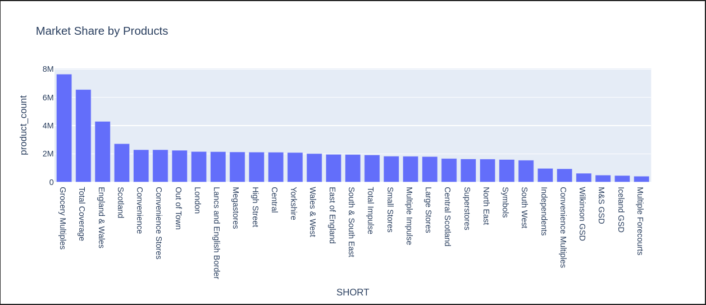
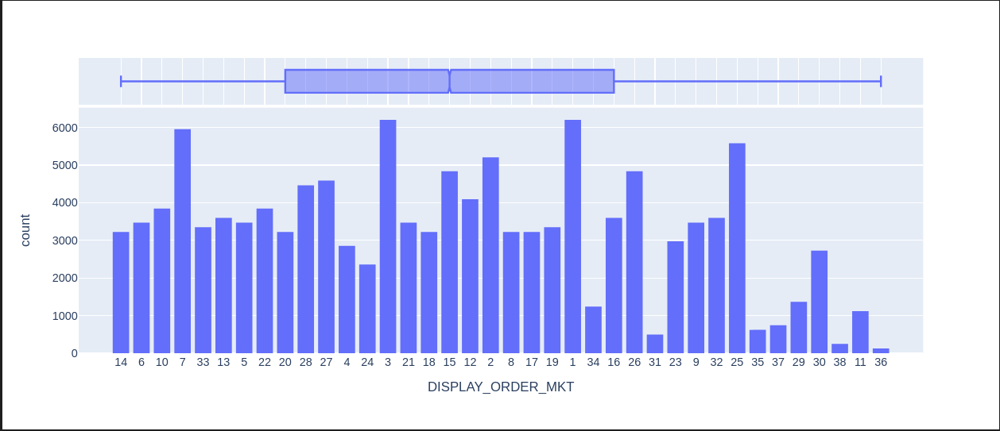
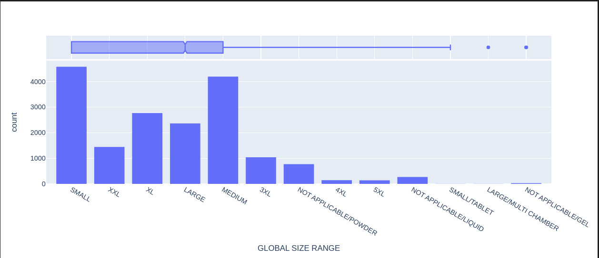

# Data Engineer Bent Oak Systems

<p align=center>
    
</p>

## Table of Contents 🏗️

- [Data Engineer Bent Oak Systems](#data-engineer-bent-oak-systems)
  - [Table of Contents 🏗️](#table-of-contents-️)
  - [Project Description 🌱](#project-description-)
  - [PostgreSQL Deployment 🚀](#postgresql-deployment-)
    - [Prerequisites](#prerequisites)
    - [Deployment Steps](#deployment-steps)
  - [Data Exploration Procedure 🔧](#data-exploration-procedure-)
    - [Introduction](#introduction)
      - [Local System Limitations and Handling Large Data](#local-system-limitations-and-handling-large-data)
      - [Production Environment Considerations](#production-environment-considerations)
    - [Sections](#sections)
  - [Insights of Data 💡](#insights-of-data-)
    - [Functions](#functions)
    - [Writing Data on Postgres](#writing-data-on-postgres)
    - [Explore on Data on Postres](#explore-on-data-on-postres)
    - [Reading and Exploration of Data as Pandas DataFrames](#reading-and-exploration-of-data-as-pandas-dataframes)
    - [Data Description: rb\_dishwashweekly\_gb\_fact\_data\_07072021](#data-description-rb_dishwashweekly_gb_fact_data_07072021)
      - [Sample Data:](#sample-data)
    - [Melting Data and Merging:](#melting-data-and-merging)
      - [Why Melting:](#why-melting)
      - [Melting Process:](#melting-process)
      - [Merging Process:](#merging-process)
      - [Result:](#result)
    - [Merging Tables for a Comprehensive View:](#merging-tables-for-a-comprehensive-view)
      - [Merging Process:](#merging-process-1)
      - [Result:](#result-1)
    - [Overview of the Total Dataframe:](#overview-of-the-total-dataframe)
      - [Initial Rows Preview:](#initial-rows-preview)
      - [Observations:](#observations)
      - [Recommendations:](#recommendations)
    - [Handling Missing Values:](#handling-missing-values)
    - [Profiling](#profiling)
    - [Outlier Analysis](#outlier-analysis)
      - [Numeric Data - DISPLAY\_ORDER\_MKT:](#numeric-data---display_order_mkt)
      - [Categorical Data - GLOBAL SIZE RANGE:](#categorical-data---global-size-range)

## Project Description 🌱

This project focuses on the exploration of the `Dishwash` dataset stored in a `PostgreSQL database`. The primary objectives include understanding the dataset's structure and getting insight from the data.

## PostgreSQL Deployment 🚀

To facilitate data exploration and analysis, PostgreSQL is used as the database for this project. The deployment is orchestrated using Docker Compose, providing an isolated and reproducible environment.

### Prerequisites

Before proceeding with the deployment, ensure that Docker and Docker Compose are installed on your machine. If not, you can download and install them from the official [Docker website](https://www.docker.com/get-started).

### Deployment Steps

1. **Configure PostgreSQL Environment Variables:**
    Open the docker-compose.yml file and customize the PostgreSQL environment variables under the postgres service. Adjust the values for `POSTGRES_DB`, `POSTGRES_USER`, and `POSTGRES_PASSWORD` according to your project requirements.
2. **Deploy PostgreSQL Container:**
  ```bash
    docker-compose up -d
  ```
3. **Access PostgreSQL Database:**
  You can access the PostgreSQL database using your preferred PostgreSQL client or command-line tools. The default configuration exposes PostgreSQL on port 5432. Use the configured username and password to connect.

## Data Exploration Procedure 🔧

### Introduction
Welcome to the data exploration and analysis notebook for the Dishwash dataset! You can find the notebook and also `pandas-profiling` result in the `notebook.zip` file by decompressing it.

#### Local System Limitations and Handling Large Data

Due to hardware constraints on my local system, which is unable to handle the entirety of the dataset (approximately 4GB), certain strategies were employed to overcome this limitation. The dataset, residing in a PostgreSQL database, was **queried in parts** or **sampled** to ensure feasibility within the local environment.

In order to navigate the challenges posed by the dataset's size, a combination of techniques was applied. For instance, partial data was retrieved from the PostgreSQL database to facilitate exploratory analyses. Additionally, a subset of the data (e.g., 1000 rows) was sampled for initial exploration and development of various code sections.

#### Production Environment Considerations

It's important to note that the local environment constraints do not reflect the ideal conditions for large-scale data processing. In a production environment, leveraging distributed computing frameworks, such as `Apache Spark`, would be pivotal *(I have written read and write functions on Postgres by Spark in the notebook as well)*. A Spark cluster would enable seamless handling of the entire dataset, distributing computations across nodes and efficiently utilizing available RAM resources.

The subsequent sections showcase the steps taken for data exploration, cleaning, transformation, and analysis, considering both the limitations of the local system and the potential scalability in a production environment.

### Sections

The notebook is structured into the following sections:

1. Writing data on Postgres
2. Explore data by Querying directly on Postgres
   1. Show data
   2. Plot
3. Get sample data from Postgres
   1. Pandas profiling
   2. Do analysis

Now, let's delve into the specifics of each section to uncover valuable insights from the Dishwash dataset.

## Insights of Data 💡

### Functions

These functions facilitate the reading and writing of data between Pandas DataFrames and PostgreSQL, providing flexibility for different scenarios and environments. The Spark-related functions are included for scalability considerations in a distributed computing environment. 

1. **read_from_postgres**
    - **Input Parameters:**
        - `config`: Dictionary containing PostgreSQL connection details (user, password, host, port, database).
        - `table_name`: Name of the table to read data from.
        - `sample`: Number of random samples to retrieve (default is 0, which means all rows).
    - **Output:**
        - Returns a Pandas DataFrame containing the retrieved data.
    - **Description:**
        - Establishes a connection to the specified PostgreSQL database using SQLAlchemy.
        - Constructs a SQL query to fetch either all rows or a random sample from the specified table.
        - Loads the queried data into a Pandas DataFrame and prints a success message.

2. **write_to_postgres**
    - **Input Parameters:**
        - `config`: Dictionary containing PostgreSQL connection details (user, password, host, port, database).
        - `file_name`: Name of the CSV file (without extension) to write to PostgreSQL.
    - **Description:**
        - Connects to the PostgreSQL server using psycopg2.
        - Reads the header row from the CSV file to determine column names.
        - Creates a table if it doesn't exist, using the header row as column names.
        - Copies the data from the CSV file to the PostgreSQL table.
    
3. **write_to_postgres_spark**
    - **Input Parameters:**
        - `config`: Dictionary containing PostgreSQL connection details (user, password, host, port, database).
        - `file_name`: Name of the CSV file (without extension) to write to PostgreSQL using Spark.
    - **Description:**
        - Initializes a Spark session.
        - Reads the CSV file into a PySpark DataFrame.
        - Configures PostgreSQL connection properties.
        - Writes the PySpark DataFrame to PostgreSQL using JDBC.
        - Stops the Spark session.

4. **read_from_postgres_spark**
    - **Input Parameters:**
        - `config`: Dictionary containing PostgreSQL connection details (user, password, host, port, database).
        - `table_name`: Name of the table to read data from using Spark.
    - **Output:**
        - Returns a Pandas DataFrame containing the retrieved data.
    - **Description:**
        - Initializes a Spark session.
        - Configures PostgreSQL connection properties.
        - Reads data from PostgreSQL into a PySpark DataFrame.
        - Optionally shows the PySpark DataFrame.
        - Stops the Spark session.
        - Converts the PySpark DataFrame to a Pandas DataFrame (optional).

### Writing Data on Postgres

This code block automates the process of writing multiple CSV files to PostgreSQL. It iterates through each file, prints a message, and uses the write_to_postgres function to handle the data writing process. The status of each write operation is displayed to keep the user informed.

### Explore on Data on Postres

The "Exploring Data on PostgreSQL" section involves querying data directly from a PostgreSQL database using SQL queries. The primary objective is to perform exploratory data analysis and generate insights from the Dishwash dataset. The code consists of two SQL queries, each followed by loading the query results into a Pandas DataFrame and visualizing the data.

1. **Querying Sum of Numeric Columns by Market Tag:**
    - The first SQL query (`select_query`) calculates the sum of two specific numeric columns, converted to numeric types, grouped by "MKT_TAG" from the table 'rb_dishwashweekly_gb_fact_data_07072021'.
    - The query result is loaded into a Pandas DataFrame (`df`), and a success message is printed.

2. **Querying Product Count by Market Short Name:**
    - The second SQL query (`select_query`) joins two tables, 'rb_dishwashweekly_gb_fact_data_07072021' and 'rb_dishwashweekly_gb_mkt_07072021', on the "MKT_TAG" and "TAG" columns, respectively.
    - The count of "PROD_TAG" is calculated for each unique "SHORT" in the market table, and the result is loaded into another Pandas DataFrame (`df`).
    - A success message is printed after loading the data.

3. **Visualizing Market Share by Products:**
    - The Pandas DataFrame (`df`) obtained from the second query is used to create a bar plot using Plotly Express (`px.bar`).
    - The x-axis represents the "SHORT" values, and the y-axis represents the corresponding "product count".
    - The title of the plot is set to "Market Share by Products," and the bar mode is configured as 'group.'

<p align=center>
    
</p>

### Reading and Exploration of Data as Pandas DataFrames

In this section, data is read from the PostgreSQL database into Pandas DataFrames for further exploration. Different tables are loaded to examine the structure and content of the Dishwash dataset. The code utilizes the custom `read_from_postgres` function to read data selectively, allowing for quick exploration and analysis without overwhelming the local system.

1. **Reading Sampled Data Table:**
    - The main fact table, 'rb_dishwashweekly_gb_fact_data_07072021,' is sampled by selecting 1000 rows. This is done to facilitate faster exploration and analysis on a local system that may not handle the entire dataset efficiently. The sampled data is stored in the Pandas DataFrame `df_main`.

2. **Reading Dimension Table:**
    - The dimension table 'rb_dishwashweekly_gb_dim_07072021' is read into the Pandas DataFrame `df_dim`. This table typically contains additional descriptive attributes related to the main data.

3. **Reading Fact Table:**
    - The fact table 'rb_dishwashweekly_gb_fct_07072021' is loaded into the Pandas DataFrame `df_fct`. Fact tables often contain numerical measures and foreign keys related to the business process.

4. **Reading Market Table:**
    - The market-related table 'rb_dishwashweekly_gb_mkt_07072021' is read into the Pandas DataFrame `df_mkt`. This table may contain information about different markets.

5. **Reading Period Table:**
    - The period-related table 'rb_dishwashweekly_gb_per_07072021' is loaded into the Pandas DataFrame `df_per`. This table could contain period metrics or key period indicators (KPIs).

6. **Reading Product Table:**
    - The product-related table 'rb_dishwashweekly_gb_prod_07072021' is read into the Pandas DataFrame `df_prod`. This table might include information about the various products.


### Data Description: rb_dishwashweekly_gb_fact_data_07072021

The dataset 'rb_dishwashweekly_gb_fact_data_07072021' represents weekly data related to dishwash products. Below is a brief description of the data exploration for this particular table.

#### Sample Data:

The table contains 127 columns, and here is a sample of the first five rows:

```bash
df_main.head()
```
MKT_TAG	PROD_TAG	PER_TAG	...	F000000000000000521900000000000000031002
M000000000000103175200000000000001065270	P000000000000030451200000000012980939805	W2019038	...	None
M000000000000103175200000000000001065279	P000000000000030448200000000012277528731	W2019006	...	None
M000000000000103175200000000000001065278	P000000000000030450200000000011429221733	W2020011	...	None
M000000000000103175200000000000001065277	P000000000000030448200000000010005636088	W2018034	...	None
M000000000000103175300000000000001065282	P000000000000030451200000000001980092592	W2018041	...	None


**Data Information:**

Here is some key information about the dataset:

```bash
df_main.info()
```
- The dataset comprises 1000 entries and 127 columns.
- All columns have the 'object' data type, indicating mixed types.

**Descriptive Statistics:**

```bash
df_main.describe()
```

- The 'describe' method provides basic statistical information about the dataset.
- It includes counts, unique values, top occurrences, and frequency for each column.

**Observations:**

- The 'MKT_TAG' column appears to represent market tags, with the top market tag being 'M000000000000103175300000000000001005858.'
- The 'PROD_TAG' column contains unique product tags, with some products having multiple occurrences.
- The 'PER_TAG' column likely represents period tags, indicating different period metrics.

### Melting Data and Merging:

In data analysis, melting is the process of transforming a dataset from a wide format to a long format. This reshaping is useful when dealing with datasets where columns represent different variables or measurements. The melted data is then merged with another dataset to enhance its comprehensibility and facilitate further analysis.

#### Why Melting:

- **Handling Wide Data:**
  Wide-format data, where each variable has its own column, can be cumbersome to work with. Melting allows us to convert this wide format into a long format, making the data more manageable.

- **Facilitating Analysis:**
  Melting is often a precursor to various analyses, especially those involving comparisons or aggregations across multiple variables. It simplifies the process of grouping and summarizing data.

- **Merging for Enrichment:**
  Merging the melted data with another dataset (column_table) adds additional information to each variable, making it more meaningful.

#### Melting Process:

The Pandas `melt` function is employed to reshape the main_table. It takes the initial dataframe (`df_main`), specifies the identifier variables (`id_vars`), and transforms the rest of the columns into two new columns: 'ColumnName' and 'UniqueID'. This process essentially stacks the variable columns into a single column ('ColumnName') and their corresponding values into another column ('UniqueID').

#### Merging Process:

The melted main_table (`df_melted`) is merged with the column_table (`df_fct`) using the 'ColumnName' from the melted table and the 'TAG' column from the column_table. The result (`df_merged_fct`) is then refined by dropping unnecessary columns ('ColumnName', 'TAG', 'UniqueID').

#### Result:

The resulting dataframe (`df_merged_fct`) is enriched with information from the column_table, providing a more comprehensive view of the data for further analysis.

```bash
# Melt the main_table to transform it
df_melted = pd.melt(df_main, id_vars=list(df_main.columns[:3]),
                             value_vars=list(df_main.columns[3:]), var_name='ColumnName', value_name='UniqueID')

# Merge the melted_main_table with the column_table
df_merged_fct = df_melted. merge(df_fct, left_on='ColumnName', right_on='TAG') \
    .drop(['ColumnName', 'TAG', 'UniqueID'], axis=1)

df_merged_fct
```

### Merging Tables for a Comprehensive View:

The merging process involves combining multiple dataframes to create a unified and comprehensive dataset. In this specific step, three additional tables, namely `df_mkt`, `df_prod`, and `df_per`, are merged with the previously enriched table `df_merged_fct`. The goal is to bring together information from these different tables into a single, consolidated dataframe.

#### Merging Process:

1. **MKT Table:**
   - `df_merged_fct` is merged with `df_mkt` using the 'MKT_TAG' column from the former and the 'TAG' column from the latter.
   - The resulting dataframe is then refined by dropping unnecessary columns ('MKT_TAG', 'TAG').

2. **PROD Table:**
   - The merged dataframe from the previous step is further merged with `df_prod` using the 'PROD_TAG' column from the former and the 'TAG' column from the latter.
   - Unnecessary columns ('PROD_TAG', 'TAG') are dropped to streamline the dataframe.

3. **PER Table:**
   - The dataframe resulting from the PROD table merge is once again merged, this time with `df_per`, using the 'PER_TAG' column from the former and the 'TAG' column from the latter.
   - Similar to the previous steps, unnecessary columns ('PER_TAG', 'TAG') are dropped for clarity.

#### Result:

The final merged dataframe (`df_total`) brings together information from multiple tables, providing a consolidated view that encompasses market details (`df_mkt`), product details (`df_prod`), period details (`df_per`), and enriched fact details (`df_merged_fct`). This comprehensive dataset is now ready for further analysis and insights.

```bash
df_total = df_merged_fct.merge(df_mkt, left_on='MKT_TAG', right_on='TAG', how='outer', suffixes=('', '_MKT')) \
    .drop(['MKT_TAG', 'TAG'], axis=1) \
    .merge(df_prod, left_on='PROD_TAG', right_on='TAG', how='outer', suffixes=('', '_PROD')) \
    .drop(['PROD_TAG', 'TAG'], axis=1) \
    .merge(df_per, left_on='PER_TAG', right_on='TAG', how='outer', suffixes=('', '_PER')) \
    .drop(['PER_TAG', 'TAG'], axis=1)
df_total.head()
```

### Overview of the Total Dataframe:

#### Initial Rows Preview:
Here is a glimpse of the first few rows of the merged dataframe (`df_total`). This dataset is the result of combining information from multiple tables, providing a comprehensive view of market details (`df_mkt`), product details (`df_prod`), period details (`df_per`), and enriched fact details (`df_merged_fct`).
```bash
df_total.head()
```

**Dataframe Information:**
```bash
df_total.info()
```
The `df_total` dataframe contains a total of 131,713 entries and 60 columns. The data types of the columns vary, including object types indicating categorical variables.

**Summary Statistics:**
```bash
df_total.describe()
```
The descriptive statistics summary provides an overview of the dataset, including count, unique values, top values, and frequency for each column.

#### Observations:

- The dataframe exhibits variations in non-null counts across columns, suggesting potential missing or incomplete data.
- Categorical variables such as 'SHORT,' 'LONG,' and 'CURRENCY' are predominant, indicating diverse market and product categories.
- The 'DISPLAY_ORDER' column reflects the order of display, providing insights into the structure of the dataset.

#### Recommendations:

- Further investigation is needed to address missing values, especially in columns like 'PARENT_TAG' and 'HIER_LEVEL_NUM_PER.'
- The categorical columns offer opportunities for segmentation and analysis based on market, product, and period attributes.
- Consider additional data exploration and visualization to uncover patterns, trends, and potential outliers in the dataset.

### Handling Missing Values:

The examination of missing values in the `df_total` dataframe reveals the extent of missing data in each column. This information is crucial for deciding how to handle these missing values during data preprocessing.

```bash
df_total.isnull().sum()
```
- The output shows the count of missing values for each column.
Some columns, such as 'PARENT_TAG' and 'HIER_LEVEL_NUM_PER,' have a considerable number of missing values.
- Due to the time constraints and the lack of detailed information about the data, no specific actions have been taken to address missing values.
- If you check `pandas-profiling` result, you can see the ones that are not considerable.

### Profiling

Please check `Bento-DishWash-Profiling.html` in the `notebooks.zip` to get more information of the data.
It has been generated based on `df_total`:

```bash
profile= ProfileReport(df_total, title='Bento-DishWash-Profiling-Report', explorative=True)
profile.to_file("Bento-DishWash-Profiling.html")
```

### Outlier Analysis

#### Numeric Data - DISPLAY_ORDER_MKT:

1. **Histogram with Box Plot:** 
  
   <p align=center>
    
  </p>

2. **Skewness and Kurtosis:**
  - Skewness (0.109): Skewness is a measure of the asymmetry of a probability distribution. A skewness value of 0 indicates a perfectly symmetrical distribution. Positive skewness indicates a distribution that is skewed to the right, meaning that the right tail is longer or fatter than the left. Negative skewness indicates a distribution that is skewed to the left, meaning that the left tail is longer or fatter than the right. In your case, the positive skewness (0.109) suggests a slight skewness to the right, but it's relatively close to a symmetrical distribution.

  - Kurtosis (-1.169): Kurtosis measures the "tailedness" of the probability distribution. It assesses whether the data are heavy-tailed or light-tailed compared to a normal distribution. A kurtosis value of 0 indicates that the distribution has tails similar to a normal distribution. Positive kurtosis indicates heavy tails, and negative kurtosis indicates light tails. Your kurtosis value of -1.169 indicates that the distribution has lighter tails than a normal distribution.

3. **Standardizing and Displaying Range:**
- StandardScaler is applied to standardize the numeric column, making it compatible for outlier analysis.
- The low and high ranges are displayed after standardization.

4. **Scaling Using RobustScaler:**
- RobustScaler is applied to handle outliers more effectively than StandardScaler, especially in the presence of extreme values.
  
5. **IQR Method for Outlier Detection:**
- The Interquartile Range (IQR) method is employed to detect outliers.
- The upper and lower bounds are determined based on the IQR.

6. **Removing Outliers:**
- Data points outside the upper and lower bounds are identified and removed from the dataset.

#### Categorical Data - GLOBAL SIZE RANGE:


1. **Histogram with Box Plot:**

Similar to the numeric data, a histogram with a box plot is used to visualize the distribution of the categorical column GLOBAL SIZE RANGE.
Note: Categorical data doesn't have outliers in the traditional sense, so the focus is on distribution characteristics.

<p align=center>
    
  </p>


**Important General Note:**
The provided methods aim to identify and handle outliers in the dataset. However, the effectiveness of these methods depends on the specific characteristics of the data. In the case of the provided samples, significant outliers are not observed. The code can be adapted for other numeric columns as needed, and additional exploration may be required for a comprehensive understanding of the dataset. Adjustments to the outlier detection methods or consideration of domain knowledge may be necessary for optimal results.